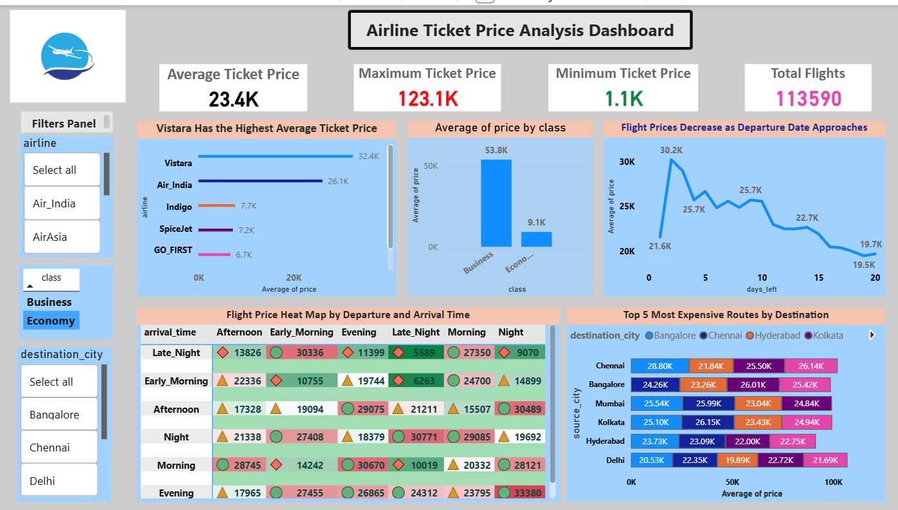

# 📊 Airline Ticket Price Analysis Dashboard

## 📌 Project Overview
This project is an interactive data visualization dashboard built using Microsoft Power BI to analyze airline ticket prices based on multiple influencing factors such as airline, booking time, travel class, departure/arrival time, and travel routes.

The dashboard helps in identifying pricing patterns and provides valuable insights for decision-making.

---

## 🎯 Key Objectives

- Analyze how ticket prices vary across different airlines  
- Understand the impact of booking time on ticket prices  
- Compare ticket prices between Economy and Business class  
- Identify expensive routes based on source and destination  
- Analyze price variation based on departure and arrival time  

---

## 📈 Key Insights

- ✈️ **Vistara has the highest average ticket price**  
- 📅 Ticket prices **increase as the departure date approaches**  
- 💼 **Business class tickets are significantly more expensive** than economy  
- 🌍 Some routes are more expensive than others  
- ⏰ Flight prices vary based on **departure and arrival time**

---

## 📊 Dashboard Features

- KPI Cards (Average Price, Maximum Price, Minimum Price, Total Flights)  
- Airline-wise price comparison  
- Booking time vs price trend analysis  
- Class-based price comparison  
- Heat map for departure and arrival time  
- Top 5 most expensive routes  
- Interactive filters (Airline, Class, Destination)

---

## 🛠️ Tools & Technologies Used

- Microsoft Power BI  
- Microsoft Excel  
- Data Visualization Techniques  

---

## 📷 Dashboard Preview

---

## 📂 Dataset Information

The dataset includes:

- Airline  
- Source City  
- Destination City  
- Departure Time  
- Arrival Time  
- Travel Class  
- Days Left for Departure  
- Ticket Price  

---

## 🚀 How to Use

1. Download the `.pbix` file  
2. Open it in Microsoft Power BI  
3. Use filters to explore different insights  

---

## 💡 Future Improvements

- Add machine learning model for price prediction  
- Include more datasets for better accuracy  
- Enhance UI with advanced Power BI visuals  

---

## 👨‍💻 Author

**Bhushan Mandekar**

---

## ⭐ If you like this project

Give it a ⭐ on GitHub and share your feedback!
